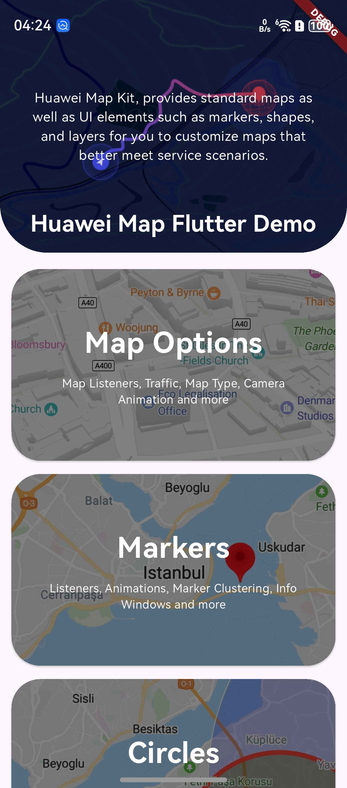

<p align="center">
  <h1 align="center">Huawei Map Flutter Plugin</h1>
</p>

> [!NOTE]
> **We've supported native HarmonyOS (鸿蒙) maps!** For detailed API support information, please refer to [ohos_unsupported_features.md](ohos_unsupported_features.md).
>
> **我们已经支持原生鸿蒙地图！** 详细的 API 支持情况，请查阅 [ohos_unsupported_features.md](ohos_unsupported_features.md)。

> 鸿蒙系统 使用 自行 放开注释代码:lib/src/channel/huawei_map_method_channel.dart:buildView

> For HarmonyOS, use the self-released comment code :lib/src/channel/huawei_map_method_channel.dart:buildView

<p align="center">
  <a href="https://pub.dev/packages/huawei_map"></a>
</p>


----

Huawei Map Kit, provides standard maps as well as UI elements such as markers, shapes, and layers for you to customize maps that better meet service scenarios. Enables users to interact with a map in your app through gestures and buttons in different scenarios.

Huawei Map Kit provides the following core capabilities:
- **Huawei Map**: Core map component with tons of features.
- **My Location**: Your location on the map.
- **Markers**: Adding markers on the map with tons of modifications with their InfoWindow component.
- **Polylines**: Adding polylines on the map with tons of modifications.
- **Polygons**: Adding polygons on the map with tons of modifications.
- **Circles**: Adding circles on the map with tons of modifications.
- **Ground Overlays**: Adding ground overlays on the map with tons of modifications.
- **Tile Overlays**: Adding tile overlays on the map with tons of modifications.

This plugin enables communication between Huawei Map Kit SDK and Flutter platform. It exposes all functionality provided by Huawei Map Kit SDK.

[Learn More](https://developer.huawei.com/consumer/en/doc/HMS-Plugin-Guides/introduction-0000001050296908-V1?ha_source=hms1)




## Installation

Please see [pub.dev](https://pub.dev/packages/huawei_map/install) and [AppGallery Connect Configuration](https://developer.huawei.com/consumer/en/doc/HMS-Plugin-Guides/config-agc-0000001050296920-V1?ha_source=hms1).

## Documentation

- [Quick Start](https://developer.huawei.com/consumer/en/doc/HMS-Plugin-Guides/createmap-0000001050190759-V1?ha_source=hms1)
- [Reference](https://developer.huawei.com/consumer/en/doc/HMS-Plugin-References/overview-0000001051586849-V1?ha_source=hms1)

## Imperative overlays

Markers and all other overlay types can be changed through
`HuaweiMapController` without rebuilding `HuaweiMap`:

```dart
final Marker marker = Marker(
  markerId: const MarkerId('destination'),
  position: const LatLng(39.9042, 116.4074),
);

await controller.addMarker(marker);
await controller.updateMarker(
  marker.updateCopy(position: const LatLng(31.2304, 121.4737)),
);
await controller.removeMarker(marker.markerId);
```

Single-object and batch APIs are available for `Marker`, `Polyline`, `Polygon`,
`Circle`, `GroundOverlay`, `TileOverlay`, and `HeatMap`. For example,
`addMarkers`, `updateMarkers`, and `removeMarkers` send the whole batch in one
platform-channel call. These overlays are managed exclusively through
`HuaweiMapController`; `HuaweiMap` no longer accepts overlay set properties.

Android and HarmonyOS 6.0.0(20) and later support append-only, non-interactive
mass points. Each call can add a batch without assigning IDs:

```dart
await controller.addMassPoints([
  const MassPoint(
    center: LatLng(39.9042, 116.4074),
    screenRadius: 6,
    color: 0xFF802AFF,
  ),
]);
```

`screenRadius` stays visually fixed while zooming. Points with different colors
or radii are automatically grouped into native `MassPointOverlay` instances.
HarmonyOS uses Map Kit's native `MassPointOverlay`. Because Huawei Map Kit for
Android has no matching overlay, Android draws all points in one shared,
non-interactive view and reprojects them when the camera moves.

## Draw on the map

Android and HarmonyOS can convert every drawing touch point to a geographic
coordinate with the native map projection:

```dart
HuaweiMap(
  initialCameraPosition: const CameraPosition(
    target: LatLng(39.9042, 116.4074),
    zoom: 14,
  ),
  drawingEnabled: true,
  onDrawStart: (LatLng point) {
    // Start a new path.
  },
  onDrawUpdate: (LatLng point) {
    // Update a Polyline or a custom drawing layer.
  },
  onDrawEnd: (List<LatLng> points) {
    // Persist or process the complete geographic path.
  },
)
```

Drawing consumes the current single-finger gesture, so it does not pan or zoom
the map. Set `drawingEnabled` to `false` and rebuild the widget to restore
normal map gestures.

To convert a Flutter touch coordinate independently, pass the map-local logical
position directly to the controller:

```dart
Listener(
  onPointerMove: (PointerMoveEvent event) async {
    final LatLng point =
        await controller.getLatLngFromTouch(event.localPosition);
    // Use the geographic point.
  },
  child: HuaweiMap(
    initialCameraPosition: initialCameraPosition,
    onMapCreated: (HuaweiMapController value) => controller = value,
  ),
)
```

`getLatLngFromTouch` performs native logical-to-physical coordinate conversion:
HarmonyOS uses `UIContext.vp2px()` and Android uses the display density. Do not
multiply `event.localPosition` by a density value yourself. The supplied
position must be relative to the map's top-left corner.

## Questions or Issues

If you have questions about how to use HMS samples, try the following options:

- [Stack Overflow](https://stackoverflow.com/questions/tagged/huawei-mobile-services) is the best place for any programming questions. Be sure to tag your question with
  **huawei-mobile-services**.
- [Github](https://github.com/HMS-Core/hms-flutter-plugin) is the official repository for these plugins, You can open an issue or submit your ideas.
- [Huawei Developer Forum](https://forums.developer.huawei.com/forumPortal/en/home?fid=0101187876626530001&ha_source=hms1) HMS Core Module is great for general questions, or seeking recommendations and opinions.
- [Huawei Developer Docs](https://developer.huawei.com/consumer/en/doc/overview/HMS-Core-Plugin?ha_source=hms1) is place to official documentation for all HMS Core Kits, you can find detailed documentations in there.

If you run into a bug in our samples, please submit an issue to the [GitHub repository](https://github.com/HMS-Core/hms-flutter-plugin).

## License

Huawei Map Kit Flutter Plugin is licensed under [Apache 2.0 license](LICENSE)
